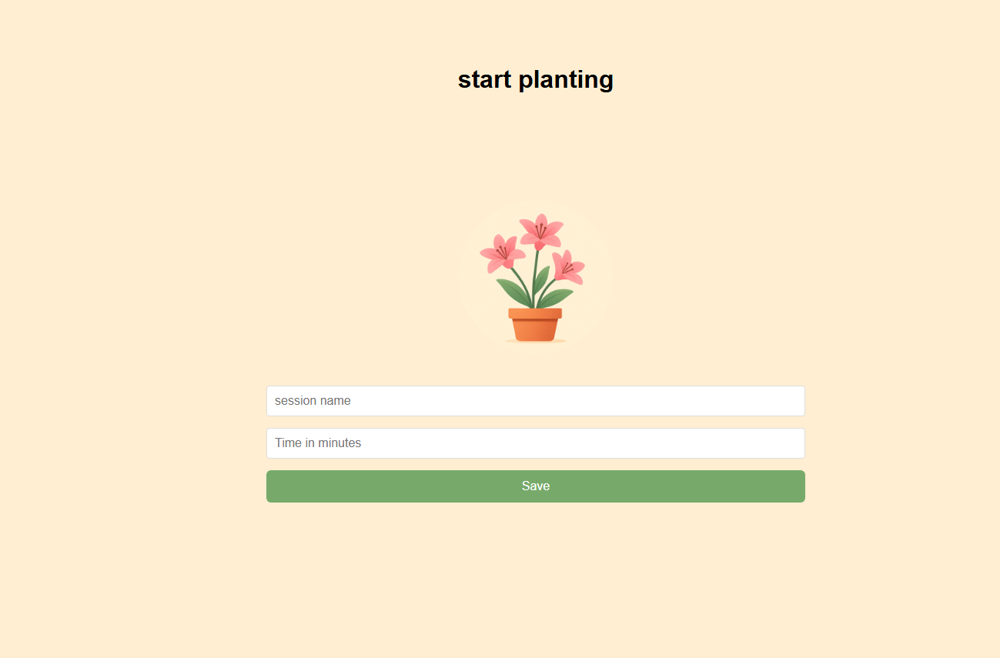

# Project 1: 'Minesweeper'

## Introduction

I chose to build minesweeper for my project 1 at General Assembly Software Engineering Bootcamp. which you can play [here](https://zahraa237.github.io/minesweeper-main/). it is a very fun game and i had so much building it

for my final project at GA Software Engineering Bootcamp, i chose to build an app that helps you focus by planting trees for whatever time you choose

## Contents

- [Introduction](#Introduction)
- [Contents](#Contents)
- [Project Brief](#Project-Brief)
- [Technologies](#Technologies)
- [timer](#timer)
- [charts](#charts)
- [In Conclusion](#In-Conclusion)

## Project Brief

the idea of the website is creating sessions that has time amd a tree to help you focus in a fun way

## Technologies

- HTML
- CSS
- JavaScript
- Git
- React
- recharts

## timer

to create the timer i started by fetching session data using the sessionId and calculating the remaining time based on the session start and end time. the countdown updates in real time and shows it to the user.

## charts

for the charts i used recharts which is a built in chart library in react
![chart] (public/readme/Screenshot 2025-09-11 140052.png)

## In Conclusion

All in all, this was not really easy but i had so much fun and learned a lot working on it, and i might work on making it better on my own time.
